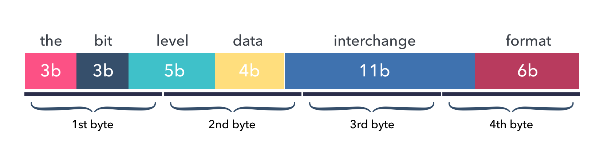

The bit level data interchange format
=====================================

.. image:: https://github.com/hit9/bitproto/workflows/bitproto%20ci/badge.svg
   :target: https://github.com/hit9/bitproto/actions?query=workflow%3A%22bitproto+ci%22
.. image:: https://readthedocs.org/projects/bitproto/badge/?version=latest
   :target: https://bitproto.readthedocs.io/en/latest/?badge=latest
.. image:: https://img.shields.io/badge/license-BSD3-brightgreen
   :target: https://bitproto.readthedocs.io/en/latest/license.html

Introduction
------------

Bitproto is a fast, lightweight and easy-to-use bit level data
interchange format for serializing data structures.

The protocol describing syntax looks like the great
`protocol buffers <https://developers.google.com/protocol-buffers>`_ ,
but in bit level:

.. sourcecode:: bitproto

   proto example

   message Data {
       uint3 the = 1
       uint3 bit = 2
       uint5 level = 3
       uint4 data = 4
       uint11 interchange = 6
       uint6 format = 7
   }  // 32 bits => 4B

The ``Data`` above is called a message, it consists of 7 fields and will occupy a total
of 4 bytes after encoding.

This image shows the layout of data fields in the encoded bytes buffer:

Code Example
------------

Code example to encode bitproto message in C:

.. sourcecode:: c

    struct Data data = {.the = 7,
                        .bit = 7,
                        .level = 31,
                        .data = 15,
                        .interchange = 2047,
                        .format = 63};
    unsigned char s[BYTES_LENGTH_DATA] = {0};
    EncodeData(&data, s);
    // length of s is 4, and the hex format is
    // 0xFF 0xFF 0xFF 0xFF

And the decoding example:

.. sourcecode:: c

    struct Data d = {};
    DecodeData(&d, s);
    // values of d's fields is now:
    // 7 7 31 15 2047 63

Simple and green, isn't it?

Code patterns of bitproto encoding are exactly similar in C, Go and Python.

Features
---------

- Supports bit level data serialization, **born for embedded development**.
- Supports protocol `extensiblity <https://bitproto.readthedocs.io/en/latest/language.html#extensibility>`_ , for backward-compatibility.
- Easy to start, syntax is similar to the well-known protobuf.
- Supports languages: `C <https://bitproto.readthedocs.io/en/latest/c-guide.html>`_ (without dynamic memory allocation),
  `Go <https://bitproto.readthedocs.io/en/latest/go-guide.html>`_, `Python <https://bitproto.readthedocs.io/en/latest/python-guide.html>`_ .
- Blazing fast encoding/decoding, `benchmark <https://bitproto.readthedocs.io/en/latest/performance.html>`_.
- We can **clearly know the size and arrangement** of encoded data, fields are compact without a single bit gap.

Schema Example
--------------

An example for a simple overview of the bitproto schema grammar:

.. sourcecode:: bitproto

    proto pen

    // Constant value
    const SIZE = 2 * 3;

    // Bit level enum.
    enum Color : uint3 {
        COLOR_UNKNOWN = 0
        COLOR_RED = 1
        COLOR_BLUE = 2
        COLOR_GREEN = 3
    }

    // Type alias
    type Timestamp = int64

    // Composite structure
    message Pen {
        Color color = 1
        Timestamp produced_at = 2
        uint3 number = 3
        uint13 value = 4
    }

    message Box {
        // Fixed-size array
        Pen[SIZE] pens = 1;
    }

Run the bitproto compiler to generate C files:

.. sourcecode:: c

    $ bitproto c pen.bitproto

Which generates two files: ``pen_bp.h`` and ``pen_bp.c``.

We can have an overview of the generated code for the C language:

.. sourcecode:: c

    // Constant value
    #define SIZE 6

    // Bit level enum.
    typedef uint8_t Color; // 3bit

    #define COLOR_UNKNOWN 0
    #define COLOR_RED 1
    #define COLOR_BLUE 2
    #define COLOR_GREEN 3

    // Type alias
    typedef int64_t Timestamp; // 64bit

    // Number of bytes to encode struct Pen
    #define BYTES_LENGTH_PEN 11

    // Composite structure
    struct Pen {
        Color color; // 3bit
        Timestamp produced_at; // 64bit
        uint8_t number; // 3bit
        uint16_t value; // 13bit
    };

    // Number of bytes to encode struct Box
    #define BYTES_LENGTH_BOX 63

    struct Box {
        // Fixed-size array
        struct Pen pens[6]; // 498bit
    };

You can checkout directory `example <example>`_ for a larger example.

Why bitproto ?
--------------

There is protobuf, why bitproto?

Origin
''''''

The bitproto was originally made when I'm working with embedded programs on
micro-controllers. Where usually exists many programming constraints:

- tight communication size.
- limited compiled code size.
- better no dynamic memory allocation.

Protobuf does not live on embedded field natively,
it doesn't target ANSI C out of box.

Scenario
'''''''''

It's recommended to use bitproto over protobuf when:

* Working on or with microcontrollers.
* Wants bit-level message fields.
* Wants to know clearly how many bytes the encoded data will occupy.

For scenarios other than the above, I recommend to use protobuf over bitproto.

Vs Protobuf
'''''''''''

The differences between bitproto and protobuf are:

* bitproto supports bit level data serialization, like the
  `bit fields in C <https://en.wikipedia.org/wiki/Bit_field>`_.

* bitproto doesn't use any dynamic memory allocations. Few of
  `protobuf C implementations <https://github.com/protocolbuffers/protobuf/blob/master/docs/third_party.md>`_
  support this, except `nanopb <https://jpa.kapsi.fi/nanopb>`_.

* bitproto doesn't support varying sized data, all types are fixed sized.

  bitproto won't encode typing or size reflection information into the buffer.
  It only encodes the data itself, without any additional data, **the encoded data
  is arranged like it's arranged in the memory**, with fixed size, without paddings,
  think setting `aligned attribute to 1 <https://stackoverflow.com/a/11772340>`_
  on structs in C.

* Protobuf works good on
  `backward compatibility <https://developers.google.com/protocol-buffers/docs/overview#backwards_compatibility>`_.
  For bitproto, this is the main shortcome of bitproto serialization until v0.4.0, since this version, it supports message's
  `extensiblity <https://bitproto.readthedocs.io/en/latest/language.html#extensibility>`_ by adding two bytes indicating
  the message size at head of the message's encoded buffer.  This breaks the
  traditional data layout design by encoding some minimal reflection
  size information in, so this is designed as an optional feature.

Known Shortcomes
''''''''''''''''

* bitproto doesn't support varying sized types. For example, a ``unit37`` always occupies
  37 bits even you assign it a small value like ``1``.

  Which means there will be lots of zero bytes if the meaningful data occupies little on
  this type.  For instance, there will be ``n-1`` bytes left zero if only one byte of a
  type with ``n`` bytes size is used.

  Generally, we actually don't care much about this, since there are not so many bytes
  in communication with embedded devices. The protocol itself is meant to be designed
  tight and compact. Consider to wrap a compression mechanism like `zlib <https://zlib.net/>`_
  on the encoded buffer if you really care.

* bitproto can't provide `best encoding performance <https://bitproto.readthedocs.io/en/latest/performance.html#the-optimization-mode>`_
  with `extensibility <https://bitproto.readthedocs.io/en/latest/language.html#extensibility>`_.

  There's an `optimization mode <https://bitproto.readthedocs.io/en/latest/performance.html#the-optimization-mode>`_ designed in bitproto
  to generate plain encoding/decoding statements directly at code-generation time, since all
  types in bitproto are fixed-sized, how-to-encode can be determined earlier at code-generation
  time. This mode gives a huge performance improvement, but I still haven't found a way to
  make it work with bitproto's extensibility mechanism together.

Documentation and Links
-----------------------

Documentation:

- Website: https://bitproto.readthedocs.io
- Documentation in Chinese: https://bitproto.readthedocs.io/zh/latest
- `Quick start tutorial <https://bitproto.readthedocs.io/en/latest/quickstart.html>`_
- `Grammar guide, in one page <https://bitproto.readthedocs.io/en/latest/language.html>`_

Editor syntax highlighting plugins:

- `Vim Plugin <editors/vim>`_
- `PyCharm Settings <editors/pycharm>`_
- `VS Code Extension <https://marketplace.visualstudio.com/items?itemName=hit9.bitproto>`_.

Faq:

- `What’s the advantage of this over a bit field? <https://bitproto.readthedocs.io/en/latest/faq.html#what-s-the-advantage-of-this-over-a-bit-field>`_

Blog posts:

- Dev notes in Chinese: https://writings.sh/post/bitproto-notes

License
-------

`BSD3 <https://bitproto.readthedocs.io/en/latest/license.html>`_
