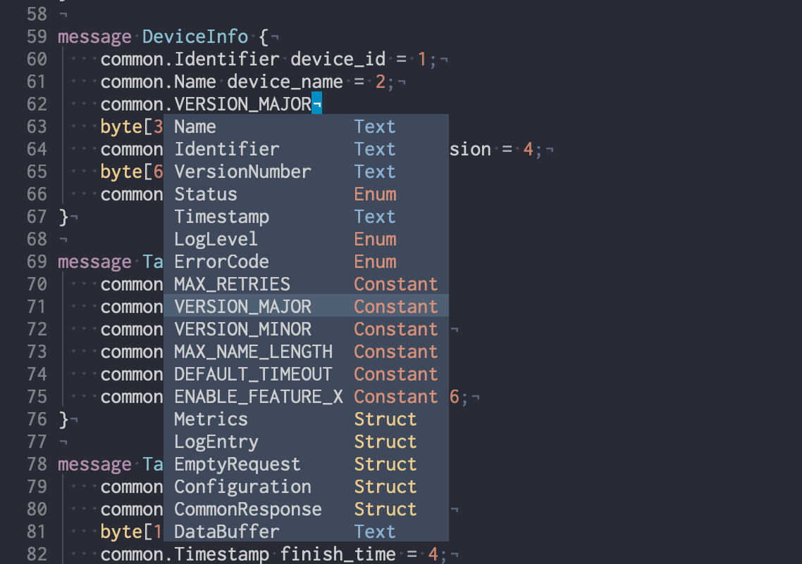

Vim syntax highlighting for bitproto
====================================

Vim syntax highlighting plugin for bitproto.

Installation
------------

For `vundle <https://github.com/VundleVim/Vundle.vim>`_ users:

.. sourcecode:: vim

   Plugin 'hit9/bitproto', {'rtp': 'editors/vim'}

For `vim-plug <https://github.com/junegunn/vim-plug>`_ users:

.. sourcecode:: vim

   Plug 'hit9/bitproto', {'rtp': 'editors/vim'}

Language Server For Neovim Users
--------------------------------

Checkout `<../language_server>`_ please.
