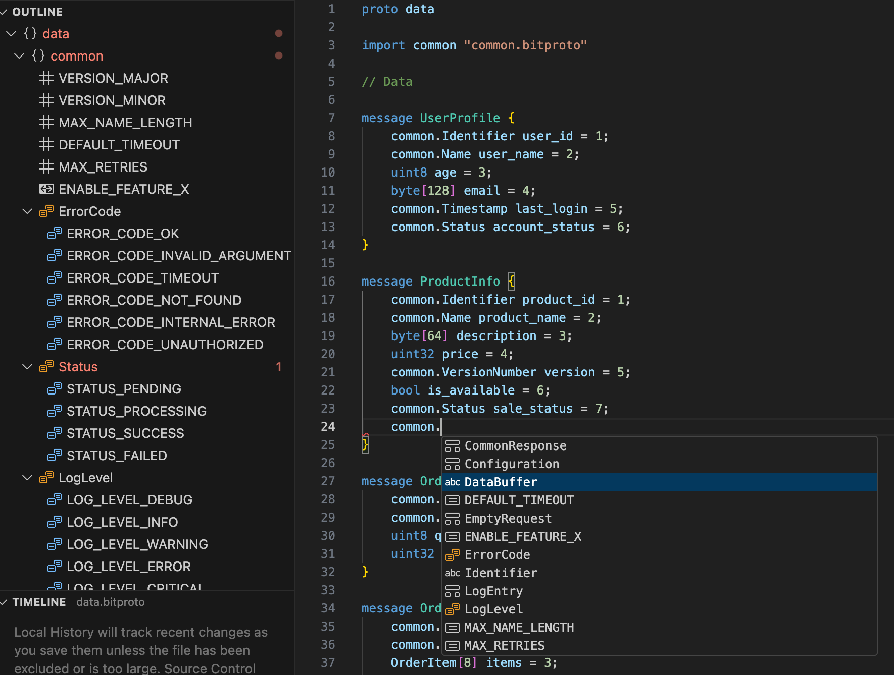

VSCode syntax highlighting for bitproto
========================================



### Install from Marketplace

https://marketplace.visualstudio.com/items?itemName=hit9.bitproto

### Install from local

Firstly, ensure `vsce` is installed:

```
$ npm install -g @vscode/vsce
```

Clone this repo, and:

```
$ cd path/to/bitproto/editors/vscode/bitproto
$ vsce package
```

This will generates `bitproto-1.2.0.vsix` in current directory.

Start VSCode editor:

* `View` -> `Extensions` -> `···` -> `Install from VSIX...`
* Then browse the `bitproto-1.2.0.vsix`.
